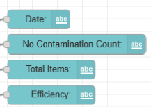

# Object Metal Detection System | Node-RED flows explaination.

### Node `template` | Node การ Custom Dashboard ต่างๆ

```html
<style>
    ui-card-panel {
        box-shadow: rgba(0, 0, 0, 0.35) 0px 5px 15px;
    }

    .nr-dashboard-theme .nr-dashboard-button .md-button {
        box-shadow: rgba(0, 0, 0, 0.17) 0px -23px 25px 0px inset, rgba(0, 0, 0, 0.15) 0px -36px 30px 0px inset, rgba(0, 0, 0,
                0.1) 0px -79px 40px 0px inset, rgba(0, 0, 0, 0.06) 0px 2px 1px, rgba(0, 0, 0, 0.09) 0px 4px 2px, rgba(0, 0, 0, 0.09) 0px 8px 4px, rgba(0, 0, 0, 0.09) 0px 16px 8px, rgba(0, 0, 0, 0.09) 0px 32px 16px;
        border-radius: 50px;
    }
    .sheet .md-button {
        box-shadow: rgba(0, 0, 0, 0.17) 0px -23px 25px 0px inset, rgba(0, 0, 0, 0.15) 0px -36px 30px 0px inset, rgba(0, 0, 0,
                0.1) 0px -79px 40px 0px inset, rgba(0, 0, 0, 0.06) 0px 2px 1px, rgba(0, 0, 0, 0.09) 0px 4px 2px, rgba(0, 0, 0, 0.09) 0px 8px 4px, rgba(0, 0, 0, 0.09) 0px 16px 8px, rgba(0, 0, 0, 0.09) 0px 32px 16px;
        border-radius: 50px;
    }
p{
    margin: 0;
    padding: 0;
}
root, a, button, p, div {
-webkit-user-select: none !important;
}

body {
background: -webkit-linear-gradient(55deg, rgb(24, 117, 106) 0%, rgb(24, 117, 106) 100%);
-webkit-touch-callout: none !important;
}
.md-toolbar-tools h1[node-id="dashboard_tab"]{
text-align: left;
font-size: 3rem;
font-weight: bold;
width: auto;
position: absolute;
transform: translateY(45%);
}
md-toolbar{
    height: 180px;
    width:auto;
    background-image:url("https://cdn.discordapp.com/attachments/915785990566719488/1348924492872679476/nr-dashboard-cardtitle.png?ex=680748d4&is=6805f754&hm=0aabdb77f8418d4687e8473317f727c4104cd36ec92a7feb501a662be47a64c4&");
    background-repeat: no-repeat;
    margin-left: 0;
    background-size: contain;
    background-position: right;
    box-shadow: rgba(50, 50, 93, 0.25) 0px 6px 12px -2px, rgba(0, 0, 0, 0.3) 0px 3px 7px -3px;
}
.md-toolbar-tools h1[node-id="dashboard_tab"]::after {
content: "By Mechanical Embedded System Laboratory Silpakorn University";
width: 400px;
display: block;
font-size: 1.3rem;
font-weight: normal;
margin-top: 0.5rem;
color: white;
}
body.md-default-theme, body, html.md-default-theme, html{
    background-color: rgb(24, 117, 106);
}
ui-card-panel{
    background-color: white;
    border-radius: 20px;
        margin: 0;
        padding: 0;
}

</style>
```
---
`ui-card-panel` (การ์ดใน Dashboard)
```css
ui-card-panel {
    box-shadow: rgba(0, 0, 0, 0.35) 0px 5px 15px;
    background-color: white;
    border-radius: 20px;
    margin: 0;
    padding: 0;
}
```
-   สร้าง เงา รอบกรอบ (Box Shadow)
-   พื้นหลังเป็นสีขาว
-   มุมมน 20px
-   ไม่มี margin และ padding

---

**<u>ปุ่ม `(.md-button)` ทั้งใน .`nr-dashboard-theme` และ `.sheet`</u>**
```css
box-shadow: rgba(...) ... inset, ...;
border-radius: 50px;
```
- ใส่เงาหลายชั้น (ทั้งด้านนอกและแบบ inset)
- ทำให้ปุ่มมีลักษณะโค้งมนเหมือนแคปซูล (radius 50px)
---
<u>**การจัดการข้อความและการเลือกข้อความ**</u>
```css
p {
    margin: 0;
    padding: 0;
}
root, a, button, p, div {
    -webkit-user-select: none !important;
}
```
- ตัด margin/padding ของ `<p>` ออก
- ปิดไม่ให้ผู้ใช้สามารถ select ข้อความในองค์ประกอบต่าง ๆ (เช่น ปุ่ม, ลิงก์ ฯลฯ)
---
<u>**พื้นหลังของหน้าเว็บ (Body)**</u>
```css
body {
    background: -webkit-linear-gradient(55deg, rgb(24, 117, 106) 0%, rgb(24, 117, 106) 100%);
    -webkit-touch-callout: none !important;
}
```
- กำหนดพื้นหลังเป็น ไล่สีเขียว (linear gradient)
- ปิดฟีเจอร์ "แตะค้างเพื่อเรียกเมนู" บนอุปกรณ์ touch screen

---

<u>**แถบด้านบน `(md-toolbar)`**</u>
```css
md-toolbar {
    height: 180px;
    background-image: url(...);
    background-repeat: no-repeat;
    background-size: contain;
    background-position: right;
    box-shadow: ...;
}
```
- กำหนดความสูง toolbar
- ใส่ภาพพื้นหลัง (รูปโลโก้หรือ banner)
- ปรับขนาดและตำแหน่งให้แสดงด้านขวา
- ใส่เงาให้มีมิติ

---

<u>**หัวข้อบน toolbar (`h1[node-id="dashboard_tab"`])**</u>
```css
font-size: 3rem;
font-weight: bold;
position: absolute;
transform: translateY(45%);
```
- กำหนดขนาดตัวอักษรใหญ่
- ตัวหนา
- ขยับตำแหน่งให้เลื่อนลงมาเล็กน้อย (translateY)

---
<u>**ข้อความเพิ่มเติมใต้หัวข้อ (`::after`)**</u>
```css
content: "By Mechanical Embedded System Laboratory Silpakorn University";
font-size: 1.3rem;
color: white;
```
- เพิ่มข้อความอัตโนมัติใต้ `<h1>` โดยใช้ `::after`
- ใช้สำหรับแสดงชื่อห้องแลบ

---
<u>**สีพื้นหลังรวมของธีม**</u>
```css
body.md-default-theme, body, html.md-default-theme, html {
    background-color: rgb(24, 117, 106);
}
```
- กำหนดสีเขียวเข้มให้กับพื้นหลังของ Node-RED Dashboard ทั้งหมด

---

# Node ต่างๆบน Dashboard 


<u>**ปุ่ม Google Sheet**</u>


```html
<button class="sheet md-raised nr-dashboard-form-button md-button md-ink-ripple" onclick="window.open('https://docs.google.com/spreadsheets/d/1Qtke5Qp4zX0WO4G5a7lNyNeLruKn14sztlmga_WB2QQ/edit?usp=sharing', '_blank');" style="background: none; border: none; padding: 0; height: 100%; width: auto;">
    
</button>
```
---

<u>**Node ชื่อปุ่ม Servo Loadcell**</u>


---
**<u>Node MQTT คำสั่งส่งไปยัง ESP32 Loadcell</u>**


- payload: `{"action": "move_3"}`
- topic: `esp32/device3/servo`
---

**<u>Node ประมวลข้อมูลต่างๆจาก MQTT</u>**


---
<u>**Node MQTT รอรับ Payload จาก ESP32 Loadcell**</u>


- payload: `esp32/device3/detected`
---

**<u>Node ปุ่ม Reset บน Dashboard เพื่อส่ง payload `0` ไปยังระบบ</u>**


- payload: `0`
- topic: `reset`
---
<u>**Node รับ Payload มา Process ว่าพบวัตถุหรือไม่**</u>


```javascript
let objectDetected = msg.payload.objectDetected;
return msg;
```
---
<u>**Node เพิ่มจำนวนนับเมื่อเจอวัตถุ**</u>


```javascript
let objectDetected = msg.payload.objectDetected;
let count = flow.get("item_count") || 0;
if (objectDetected) {
    count += 1;
    flow.set("item_count", count);
}

return { topic: "count", payload: count};
```
---
<u>**Node ส่ง topic `count` และ payload `0`**</u>


```javascript
let count = flow.set("item_count", 0);

return { topic: "count", payload: 0 };
```
---
<u>**Node แสดง LED บน Dashboard**</u>


- `{ "objectDetected": 1 }` = `สีเขียว`
- `{ "objectDetected": 0 }` = `สีแดง`

---
<u>**Node MQTT Broker รอรับค่าน้ำหนัก ผ่าน topic `esp32/device3/weight`**</u>


<u>**Node Process ค่าจาก MQTT ให้มีค่า วัน-เวลา + น้ำหนัก**</u>


```javascript
let weight = msg.payload;
let now = new Date();

let formattedDate = now.getDate().toString().padStart(2, '0') + "/" +
    (now.getMonth() + 1).toString().padStart(2, '0') + "/" +
    now.getFullYear();

let hours = now.getHours();
let ampm = hours >= 12 ? 'PM' : 'AM';
hours = hours % 12 || 12; // Convert 0 to 12 for 12-hour format

let formattedTime = hours.toString().padStart(2, '0') + ":" +
    now.getMinutes().toString().padStart(2, '0') + ":" +
    now.getSeconds().toString().padStart(2, '0') + " " + ampm;

msg.payload = [
    formattedDate,
    weight.toString(),
    formattedTime
];

return msg;
```
แล้วถูกส่งเข้า Google Sheet

---

<u>**Node แสดงจำนวนวัตถุที่นับน้ำหนักแล้วอิงค่าจาก `{{msg.payload}}`**</u>

!

---

<u>**Node แสดงน้ำหนักแปลงค่าจาก MQTT มาแสดงน้ำหนักบน Dashboard**</u>


```javascript
let weight = msg.payload;
msg.payload = weight.toString() + " grams";
return msg;
```
--- 

<u>**Node แสดงชื่อ Switch**</u>


---

<u>**Node ทั้งหมดของการแสดงผลของ Non-Contamination และ Metallic Contamination**</u>


---

<u>**Node กด Switch บน Dashboard แล้วส่ง MQTT ไปยัง ESP32 เพื่อหมุน Servo**</u>


- topic: `esp32/device1/servo`
- Reset Servo payload: `{"action": "reset_1"}`
- หมุน Servo payload: `{"action": "move_1"}`
- Reset และ ส่งค่านับ payload `{"action": "send_count_1"}`
---

<u>**Node รับค่าผ่าน MQTT แบบ Real-Time อัพเดทการนับจำนวนวัตถุที่ผ่าน**</u>


- ใช้ topic `esp32/device1/realtime`

---

<u>**Node ส่งค่าไปยังแสดงผลบน Dashboard เมื่อเกิดการ Reset**</u>


```javascript
let count = flow.set("item_count", 0);

return { topic: "count", payload: 0 };
```
---

<u>**Node Process ค่าจาก MQTT ไปยังแสดงผลบน Dashboard**</u>


```javascript
let itemsCount = msg.payload.count

return { topic: "count", payload: itemsCount };;
```
---

<u>**Node แสดงผลจำนวนนับบน Dashboard**</u>


รับค่าจาก `{{msg.payload}}`

---

<u>**Node Process ค่าจำนวนนับ เพื่อนำไปแสดงผลรวม**</u>


ไม่พบสารปนเปื้อน
```javascript
const message = msg.payload;
const today = new Date();
const todayKey = `${today.getDate()}/${today.getMonth() + 1}/${today.getFullYear()}`;

const result = {
    type: "No Contamination",
    date: todayKey,
    value: msg.payload
};

msg.payload = result;
return msg;
```

พบสารปนเปื้อน
```javascript
const message = msg.payload;
const today = new Date();
const todayKey = `${today.getDate()}/${today.getMonth() + 1}/${today.getFullYear()}`;

const result = {
    type: "Metallic Contamination",
    date: todayKey,
    value: msg.payload
};

msg.payload = result;
return msg;
```

นำ Payload ทั้งสองไปรวมกันแล้วส่งไปยัง Node Process ข้อมูลเผื่อนำไปแสดงผล


```javascript
// Initialize default result
const result = {
    status: "No data available",
    latestDate: null,
    contaminationData: {
        noContamination: "0",
        metallicContamination: "0"
    },
    totals: {
        count: 0,
        productivityPercentage: "0%",
        calculation: "(0 × 100) / 0 = 0%"
    }
};

// Process input if valid
if (Array.isArray(msg.payload) && msg.payload.length > 0) {
    // Find the latest date in the data
    let latestDate = null;
    const dateObjects = [];
    
    // Convert all dates to Date objects for comparison
    msg.payload.forEach(item => {
        const [day, month, year] = item.date.split('/');
        const dateObj = new Date(`${year}-${month}-${day}`);
        dateObjects.push({
            original: item,
            dateObj: dateObj
        });
        
        if (!latestDate || dateObj > latestDate) {
            latestDate = dateObj;
        }
    });
    
    // Format the latest date back to DD/MM/YYYY
    const latestDateFormatted = latestDate ? 
        `${latestDate.getDate()}/${latestDate.getMonth() + 1}/${latestDate.getFullYear()}` : 
        null;
    
    // Filter only the data from the latest date
    const latestData = dateObjects.filter(item => item.dateObj.getTime() === latestDate.getTime());
    
    // Initialize counters
    let noContaminationValue = 0;
    let metallicContaminationValue = 0;
    
    // Process latest data
    latestData.forEach(item => {
        const value = parseInt(item.original.value) || 0;
        
        if (item.original.type === "No Contamination") {
            noContaminationValue = value;
        } else if (item.original.type === "Metallic Contamination") {
            metallicContaminationValue = value;
        }
    });
    
    // Calculate totals
    const totalCount = noContaminationValue + metallicContaminationValue;
    const productivityPercentage = totalCount > 0 ? 
        (noContaminationValue * 100) / totalCount : 0;
    
    // Update result
    result.status = "Success";
    result.latestDate = latestDateFormatted;
    result.contaminationData = {
        noContamination: noContaminationValue.toString(),
        metallicContamination: metallicContaminationValue.toString()
    };
    result.totals = {
        count: totalCount,
        productivityPercentage: `${productivityPercentage.toFixed(2)}`,
        calculation: `(${noContaminationValue} × 100) / ${totalCount} = ${productivityPercentage.toFixed(2)}%`
    };
}

msg.payload = result;
return msg;
```

Node แสดงวันที่บน Dashboard

Node แสดงจำวัตถุทีไม่พบสารปนเปื้อน

Node แสดงจำนวนวัตถุทั้งหมด

Node แสดงประสิทธิภาพ



---

<u>**Node นำจำนวนสารปนเปื้อน และ ไม่ปนเปื้อนไปคำนวนเพื่อประสิทธิภาพของเครื่องโดยแสดงออกมาเป็น % บน Dashboard**</u>


```javascript
let percentage = msg.payload.totals.productivityPercentage + "%";

msg.payload = percentage;

return msg;
```

---

<u>**Node ทั้งหมดของการแสดงผลบน Dashboard**</u>


---

<u>**Node รับค่าจาก MQTT แล้ว Log ไปบน Google Sheet**</u>


```javascript
let count = msg.payload.count; // Extract count value
let now = new Date();

// Format date as DD/MM/YYYY
let formattedDate = now.getDate().toString().padStart(2, '0') + "/" +
    (now.getMonth() + 1).toString().padStart(2, '0') + "/" +
    now.getFullYear();

// Format time as 12-hour format with AM/PM
let hours = now.getHours();
let ampm = hours >= 12 ? 'PM' : 'AM';
hours = hours % 12 || 12; // Convert 0 to 12 for 12-hour format

let formattedTime = hours.toString().padStart(2, '0') + ":" +
    now.getMinutes().toString().padStart(2, '0') + ":" +
    now.getSeconds().toString().padStart(2, '0') + " " + ampm;

// Assign the formatted values to the payload
msg.payload = [
    formattedDate,  // "DD/MM/YYYY"
    count,         // Count value from msg.payload.count
    formattedTime   // "hh:mm:ss AM/PM"
];

return msg;
```
<u>**Node ดึงค่าจาก Google Sheet จาก ทั้ง Non-Contamination และ Metallica Contamination นำมา Process เพื่อนำไปแสดง กราฟวงกลมบน Dashboard**</u>


ปนเปื้อนเหล็ก
```javascript
const today = new Date();
const todayKey = `${today.getDate()}/${today.getMonth() + 1}/${today.getFullYear()}`;

const result = {
    type: "Metallic Contamination",
    date: todayKey,
    value: 0
};

if (Array.isArray(msg.payload) && msg.payload.length > 0) {
    const todayData = msg.payload.find(([date]) => date === todayKey);

    if (todayData) {
        result.value = parseInt(todayData[1]) || 0;
    }
}

msg.payload = result;
return msg;
```

ไม่มีสารปนเปื้อน
```javascript
const today = new Date();
const todayKey = `${today.getDate()}/${today.getMonth() + 1}/${today.getFullYear()}`;

const result = {
    type: "No Contamination",
    date: todayKey,
    value: 0
};

if (Array.isArray(msg.payload) && msg.payload.length > 0) {
    const todayData = msg.payload.find(([date]) => date === todayKey);

    if (todayData) {
        result.value = parseInt(todayData[1]) || 0;
    }
}

msg.payload = result;
return msg;
```
---

<u>**Node แสดงกราฟวงกลม**</u>


Code นำ ค่าจาก Payload มาแยกลงกราฟ
```javascript
let metallicValue = 0;
let nonContaminateValue = 0;

if (Array.isArray(msg.payload)) {
    const sortedPayload = [...msg.payload].sort((a, b) =>
        a.type === "Metallic Contamination" ? -1 : 1
    );
    sortedPayload.forEach(item => {
        if (item.type === "Metallic Contamination") {
            Object.entries(item).forEach(([key, value]) => {
                if (key !== "type") metallicValue += Number(value) || 0;
            });
        }
        else if (item.type === "No Contamination") {
            Object.entries(item).forEach(([key, value]) => {
                if (key !== "type") nonContaminateValue += Number(value) || 0;
            });
        }
    });
}

const msg1 = {
    topic: "Non Contamination",
    payload: nonContaminateValue
};

const msg2 = {
    topic: "Metallic Contamination",
    payload: metallicValue
};

return [[msg1, msg2]];
```

<u>**Node แสดงจำนวนนับวัตถุทั้งหมดที่ผ่านเข้าระบบ**</u>


```javascript
// Initialize values with 0 defaults
let metallicValue = 0;
let nonContaminateValue = 0;

// Process the payload if valid
if (Array.isArray(msg.payload)) {
    // Sort with MetallicContamination first
    const sortedPayload = [...msg.payload].sort((a, b) =>
        a.type === "Metallic Contamination" ? -1 : 1
    );

    // Process all values (not just today's)
    sortedPayload.forEach(item => {
        if (item.type === "Metallic Contamination") {
            // Sum all metallic contamination values
            Object.entries(item).forEach(([key, value]) => {
                if (key !== "type") metallicValue += Number(value) || 0;
            });
        }
        else if (item.type === "No Contamination") {
            // Sum all non-contamination values
            Object.entries(item).forEach(([key, value]) => {
                if (key !== "type") nonContaminateValue += Number(value) || 0;
            });
        }
    });
}

const total = nonContaminateValue + metallicValue;
return { topic: "total", payload: total };;
```
---

<u>**Node ดึงค่าประจำวันจาก Google Sheet จาก ทั้ง Non-Contamination และ Metallica Contamination นำมา Process เพื่อนำไปแสดง กราฟแท่งบน Dashboard**</u>


Code ไม่พบสารปนเปื้อน
```javascript
// Initialize an empty object to store the sum for each date
let dateSums = { type: "NonContamination" };

// Loop through each entry in the payload array
for (let i = 0; i < msg.payload.length; i++) {
    let date = msg.payload[i][0];  // Date is in the first element of the inner array
    let value = parseInt(msg.payload[i][1]);  // The value is in the second element

    // If the date already exists in the object, add the value to the existing sum
    if (dateSums[date]) {
        dateSums[date] += value;
    } else {
        // If the date doesn't exist yet, initialize it with the value
        dateSums[date] = value;
    }
}

// Now set the sum object to msg.payload
msg.payload = dateSums;
return msg;
```

Code พบสารปนเปื้อน
```javascript
// Initialize an empty object to store the sum for each date
let dateSums = { type: "MetallicContamination" };

// Loop through each entry in the payload array
for (let i = 0; i < msg.payload.length; i++) {
    let date = msg.payload[i][0];  // Date is in the first element of the inner array
    let value = parseInt(msg.payload[i][1]);  // The value is in the second element

    // If the date already exists in the object, add the value to the existing sum
    if (dateSums[date]) {
        dateSums[date] += value;
    } else {
        // If the date doesn't exist yet, initialize it with the value
        dateSums[date] = value;
    }
}

// Now set the sum object to msg.payload
msg.payload = dateSums;
return msg;
```
---

<u>**Node Process ค่าจาก payload นำไปแยกเป็น กราฟแท่ง**</u>


```javascript
var mobile = {};

// Initialize the labels array
mobile.labels = [];

// Initialize the series array dynamically based on the types present in the payload
mobile.series = [];

// Initialize the data array
mobile.data = [];

// Sort the payload to ensure "NoContamination" comes first for series and data
var sortedPayload = msg.payload.slice(); // Make a copy of the original payload array
sortedPayload.sort(function (a, b) {
    if (a.type === "MetallicContamination") {
        return -1;
    } else if (b.type === "MetallicContamination") {
        return 1;
    }
    return 0;
});

// Extract the types and prepare the chart data
sortedPayload.forEach(function (item, index) {
    // Add the type name to the series
    mobile.series.push(item.type);

    // If labels (dates) are not populated yet, get them from the first object (assuming all objects have the same date keys)
    if (mobile.labels.length === 0) {
        mobile.labels = Object.keys(item).filter(key => key !== 'type'); // exclude the 'type' key
    }

    // Push the data values for the current type (item)
    var dataValues = mobile.labels.map(function (date) {
        return item[date] || 0; // If a date is missing in an object, use 0 as the default
    });
    mobile.data.push(dataValues);
});

// Set the final payload
msg.payload = [mobile];

return msg;
```
---